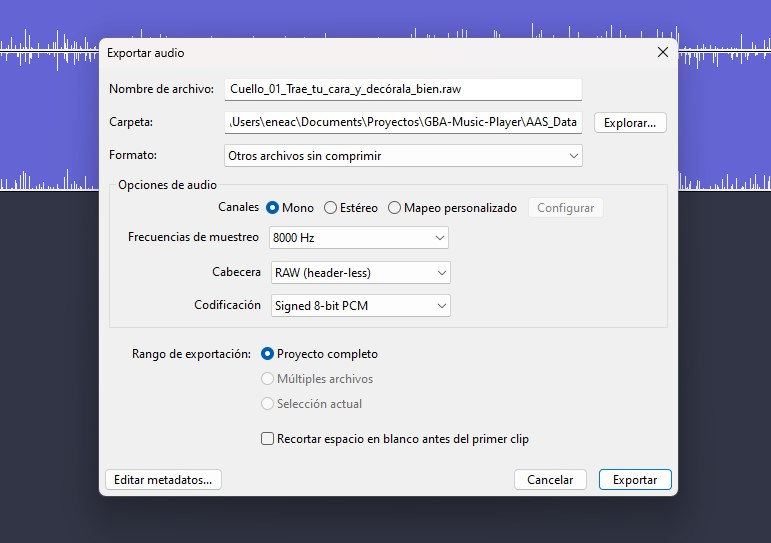

# GameBoyAdvance Music 

This is a personal project where I tried again creating a generic music player for the Game Boy Advance.
I used the Tonc library and the Apex audio system this time for this. I also simplified the code so it would be easier for anyone to compile it and create their own .gba file with their music. In the future, I plan to update this project for an easier font customization, and possibly add animations or backgrounds.

### How to create your own gba file with music

__devkitPro needed for this project, it has the necesary libraries for compilation. [devkitPro](https://github.com/devkitpro).__

Get your favourite music album and with audacity export the songs to .raw format. You could use ffmpeg too, but for some reason I get better results with the exported audacity (I'm not used to work with this tools). This means doing it by hand and takes a little more time but I think is worth it.
The Name format should be something like this <Name of the group>_<Song index>_<Name_of_the_song>.raw
The name of the group should be all together without spaces, the name of the songs spaced with _ (Will fix this in the future).

Add a background image and run the script Image2GBA. This will create a header file with the image data on the source folder called Background.h.
`py Scripts\Image2GBA.py example.jpg`

Run the script Album2GBA. This will create another header file with the music data on the source folder called Album.h.
`py Scripts\Album2GBA.py`

Now compile it with the command make and you should have a .gba file with your music that can run in real hardware.

_I will update too a way of changing the colors of the letters with a script, for now if you want to change it in main.c you can change the values of the GetTitleColor function._

Made with Tonc originally by Jasper “cearn” Vijn maintaned by gbadev-org.
Made with Advance Audio System by Ties Stuij.
Thanks to Fotocopia for tletting me use his music for this project.

GNU GENERAL PUBLIC LICENSE Version 3.